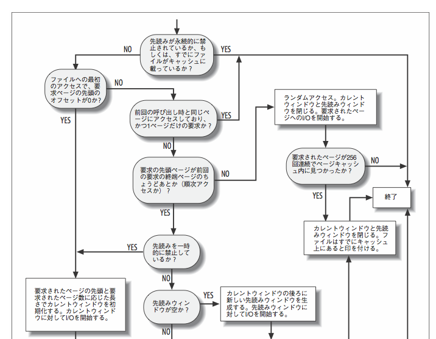
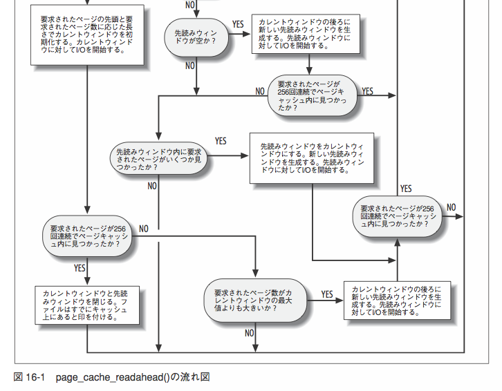
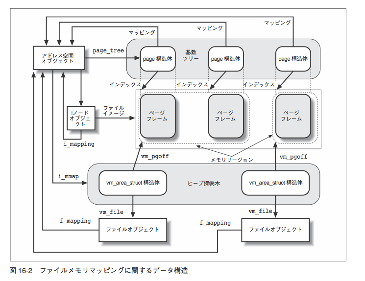

% header  
author:
title: 詳解 Linux カーネル輪読会 第16章 <br /><br /><br /><br /><small>Naotoshi Seo</small>
cover: cover.jpg

% slide

# 16章 ファイルアクセス

* ファイルアクセスは、VFS、ブロック型デバイス、ページキャッシュが絡む複雑な操作である
* この章では、ディスクベースのファイルシステムおよびブロック型デバイスファイルの両方に関して取り扱う

# ファイルアクセスモード(1)

* 5種のモード
1. 標準モード
  * O_SYNC と O_DIRECT フラグを立てない
  * read: データがユーザアドレス空間に読み込まれるまでプロセスの実行を中断する
  * write: ページキャッシュに書き込まれるとすぐに終了しプロセスの実行が再開される
2. 同期モード (O_SYNC)
  * write: ディスクへの書き込みが完了するまでプロセスの実行を中断する

# ファイルアクセスモード(2)

3. ダイレクトI/Oモード (O_DIRECT)
  * read/write はページキャッシュを使わずに、ユーザアドレス空間とディスクの間で直接データを転送する
4. メモリマッピングモード
  * ファイルをオープンした後、mmap() システムコールを発行し、ファイルをメモリにマッピング
  * アプリケーションは read(), write(), lseek() を使わずに、直接メモリのバイト列にアクセスして操作する
5. 非同期モード
  * ファイルに非同期 I/O でアクセスする

# 16.1 ファイルの読み取りと書き込み(1)

* ファイルの読み取りは、ページ単位で行う
* データがRAM上になければ
  * 新しいページフレームを確保
  * ファイルの適切な部分のデータでページを埋める
  * ページキャッシュにそのページを追加
  * 要求されたバイト列をプロセスのアドレス空間に書き込む
* 主要作業: データがディスク上のどのブロックにあるか見つけること
  * それ以外は、汎用。generic_file_read()

# 16.1 ファイルの読み取りと書き込み(2)

* ファイル書き込み操作
  * ファイルが大きい場合、カーネルがディスク上の物理ブロックを確保する必要がある
  * ファイルシステムによって異なる
* 一般的には generic_file_write()
* JFS や NFS などは別の write メソッド

# 16.1.1 ファイルの読み取り

* generic_file_read
  * VFSのレイヤから呼び出されファイルを読み込む。
  * ext2,ext3などのほとんどのファイルシステムで使用される。(NFSでは使用されない)
  * ページキャッシュを介して読み込みを行う
  * ページキャッシュがなかった場合は、各ファイルシステムのreadルーチンを呼び出して読み込みを行う

cf. http://wiki.bit-hive.com/linuxkernelmemo/pg/generic_file_read()

# 16.1.1 ファイルの読み取り

```
do_generic_file_read(ファイル構造体、バッファ, ファイルオフセット)
  for(要求サイズが満たされるまで)
    if(ページキャッシュ上にない？(__find_page_nolock関数))
      フリーページを確保(page_cache_alloc関数)
      フリーページをキャッシュに登録(__add_to_page_cache関数)
      ファイルのiノードのreadpageオペレーションを呼び出す.
    先読み要求を出しておく(generic_file_readahead関数)
    ヒットしたページへのI/O完了を待つ(wait_on_page関数)
    ページの解放(page_cache_release関数)
```

cf. https://osdn.jp/projects/linux-kernel-docs/wiki/internal24-137-%E3%83%95%E3%82%A1%E3%82%A4%E3%83%AB%E3%81%AE%E8%AA%AD%E3%81%BF%E8%BE%BC%E3%81%BF

# 16.1.1.1 通常ファイルに対する readpage メソッド

* 通常ファイルの場合は、mpage_readpage() 関数を呼び出すラッパー

```
int ext3_readpage(struct file *file, struct page *page) {
    return mpage_readpage(page, ext3_get_block);
}
```

# 16.1.1.2 ブロック型デバイスファイルに対する readpage メソッド

* ブロック型デバイスファイルの場合は常に同じ関数 blkdev_readpage() を利用する

```
int blkdev_readpage(struct file * file, struct * page page) {
    return block_read_full_page(page, blkdev_get_block);
}
```

# 16.1.2 ファイルの先読み(1)

* 先読みとは、いくつかの隣接したページを、それらが必要とされる前に読み込むこと
* ほとんどの場合、先読みによってディスク性能が向上する
  * ディスクコントローラが少ないコマンドの実行でまとめてディスクを参照できるため
* 反面、ランダムアクセスするアプリには適していない

# 16.1.2 ファイルの先読み(2)

* プロセスがファイルを順次アクセスすればするほど、ファイルの先読みは徐々に増えて行く
* 順次的でないとき、先読みの量を減らすか中止する
* プロセスが同じページを繰り返しアクセスしているとき、先読みを停止する。また、すでにファイルのほとんどのページがページキャッシュにある場合も、同様に先読みを停止する。

# 16.1.2 ファイルの先読み(3-1)

* カレントウィンドウ、先読みウィンドウ、２つのページ群を利用
* **カレントウィンドウ:** プロセスが要求したページと、カーネルが先読みしてページキャッシュに入れたページから構成される。プロセスがアクセスした最後のページに加え、まだプロセスが要求していないページが含まれていることがある。
* **先読みウィンドウ:** カレントウィンドウに続くページ群からなる。カーネルが現在まさに先読み処理を行っているページ群。まだ１度もプロセスが要求していない。

# 16.1.2 ファイルの先読み(3-2)

* カーネルが順次アクセスとして認識し、先頭ページがカレントウィンドウにある場合、カーネルは先読みウィンドウがすでに用意されているか調べ、もし用意されていなければ、先読みウィンドウを作成してページ読み込み操作を開始する。プロセスがカレントウィンドウのページを処理している間に、先読みウィンドウの転送が終わる事が理想。

# 16.1.2 ファイルの先読み(4-1)

先読みがいつ実行されるのか

* カーネルがユーザモード要求を処理し、ファイルデータのページを読み込んだとき。この処理は、page_cache_readachead() 関数を呼び出すきっかけとなる
* カーネルがファイルのメモリマッピング用にページ確保したとき。この処理は(ry
* アプリが readahead() システムコールを発行したとき

# 16.1.2 ファイルの先読み(4-2)

* アプリが POSIX_FADV_NOREUSE か POSIX_FADV_WILLNEED コマンドを指定して posix_fadvise() システムコールを発行した時。指定したファイルページ範囲に近々アクセスする予定であることをカーネルに知らせている。
* アプリが MADV_WILLNEAD を指定して madvise() システムコールを実行したとき。メモリにマッピングされた領域にある指定したファイルページ範囲に近々アクセスすることをカーネルに知らせている

# 16.1.2.1 page_cache_readachead(1)

* page_cache_readachead() 関数は、特別なシステムコールで明示的に引き起こされるもの以外の先読み操作をすべて扱う
* カレントウィンドウと先読みウィンドウを補充する
* 先読みのヒット数に照らし合わせて、ウィンドウの大きさを調整する
* page_cache_readachead(mapping, ra, filp, offset, req_size)
  * file_ra_state which holds the readahead stat

# 16.1.2.1 page_cache_readachead(2)

<a href="./pictures/fig16-01.png"></a>

# 16.1.2.1 page_cache_readachead(3)

<a href="./pictures/fig16-01.png"></a>

# 16.1.2.1 page_cache_readachead(4)

* 先読みウィンドウの大きさ
  * RA_FLAG_MISS フラグが立っていれば、max(カレントウィンドウの大きさ -2, 4) (単位は？)
  * それ以外の場合は、４倍か２倍
* 順次的でないと認識するとすぐに先読みウィンドウを禁止にする

# 16.1.2.1 page_cache_readachead(5)

凝った特性

* ブロック型デバイスを処理する要求キューが読み込みで一杯になっている場合は、読み込みを行わない
* 読み込み対象のページがページキャッシュにすでにあれば単純に処理を飛ばす
* ページフレームをすべて確保できなかった場合には、確保したページ分の先読みだけを行う。全フレームが確保できるまで先読みを延期しない。

# 16.1.2.2 handle_ra_miss()

* ページ改修アルゴリズムがページキャッシュからページを削除した
* handle_ra_miss() 関数は、RA_FLAG_MISS フラグをたてキャッシュミスが起きたことを示し、先読みアルゴリズムを調整する

# (閑話休題) fadvise DONTNEED で先読みを止める

<a href="https://github.com/sonots/growthforecast-tuning">GrowthForecast/RRDtool チューニング秘伝の書</a>

* 1回、2回程度のファイルアクセスだったので効いていた？
* デーモン動かし続けて放置したら学習されて差が出ないのかもしれない

# 16.1.3 ファイルへの書き込み(1)

* write() システムコールの主な仕事
  * 呼び出しプロセスのユーザアドレス空間からカーネルデータ構造へデータを移動すること
  * そのあとにディスクへデータを移動すること
* write() は、
  * 書き込み操作対象のディスクブロックを特定し、ユーザモードアドレス空間からページキャッシュにあるいくつかのページへデータを読み込む
  * そのあと、それらのページのバッファに汚れたことを示す印をつける

# 16.1.3 ファイルへの書き込み(2)

* generic_file_write()
* セマフォ inode->i_sem を獲得して、1プロセスしか同じファイルへのwriteを発行できないようにする => 混ざらない
* current->signal->rlim[RLIMIT_SIZE] のユーザごとの制限値を超えて通常ファイルを拡張することはできない
  * inode->i_sb->s_maxbytes にもファイルシステムの制限がある。それか 2GB

# 16.1.3 ファイルへの書き込み(3)

```
generic_file_write(ファイル構造体、ユーザ領域, ファイルポインタ)
  if(アペンドモードなら) ファイルポインタをファイルエンドにする
  while(書き込むデータがある間)
    ページキャッシュを確保する(__grab_cache_page関数)
      (もしキャッシュ上になければ新規確保し、登録する)
    ページの書き込み準備をする(iノードのprepare_writeオペレーション)
    ユーザ領域のデータをバッファに読み込む(copy_from_user関数)
    ページの書き込み要求を出す(iノードのcommit_writeオペレーション)
    ページキャッシュの解放(page_cache_release関数)
```

cf. https://osdn.jp/projects/linux-kernel-docs/wiki/internal24-138-%E3%83%95%E3%82%A1%E3%82%A4%E3%83%AB%E3%81%B8%E3%81%AE%E6%9B%B8%E3%81%8D%E8%BE%BC%E3%81%BF%E3%81%A8%E3%83%95%E3%82%A1%E3%82%A4%E3%83%AB%E6%8B%A1%E5%BC%B5

# 16.1.3.1 通常ファイルの prepare_write と commit_write

* **prepare_write**: ページの書き込み準備をする。必要があればディスクからデータを読み込んだり、バッファのクリアを行う
* **commit_write**: ページの書き込み要求を出す。dirty なバッファの遅延書き込み要求を出して終わり

```
int ext2_prepare_write(struct file *file,
  struct page *page, unsigned from, unsigned to) {
  return block_prepare_write(page, from, to, ext2_get_block);
}
```

# 16.1.3.2 ブロック型デバイスファイルの prepare_write と commit_write

```
int blkdev_prepare_write(struct file *file,
  struct page *page, unsigned from, unsigned to) {
  return block_prepare_write(page, from, to, blkdev_get_block);
}
```

# (閑話休題) RubyのLoggerはプロセスセーフなのか

<a href="http://blog.livedoor.jp/sonots/archives/32645828.html">RubyのLoggerはスレッドセーフ(＆プロセスセーフ)かどうか調べてみた - sonots:blog</a>

* write はロックを取るので混ざらない

# 16.1.4 汚れたページのディスクへの書き込み(1)

* writepages() を呼び出すと、ディスクへの書き込みが始まる
* ch15 が詳しい

```
int ext2_writepages(struct address_space *mapping,
  struct writeback_control *wbc) {
  return mpage_writepages(mapping, wbc, ext2_get_block);
}
```

# (追加) pdflush (1)


* ユーザープロセスから見た、ファイルの書き込み処理は、キャッシュページ上にデータが書き込まれた時点で終了
* キャッシュページから物理デバイスへのデータの書き出しは、カーネルスレッド pdflush がバックグラウンドで実行する
* pdflush は、任意のジョブをバックグラウンドで実行するためのカーネルスレッド。background_writeout、および、wb_kupdate の 2 種
類のジョブを実行

# (追加) pdflush (2)

* **background_writeout**
* Dirty フラグのセットされたキャッシュページ（物理デバイスにまだ書き出されていないページ）の割合が /proc/sys/vm/dirty_backgrond_ratio (デフォルト10%) 以上になった場合に起動される
* Dirty フラグのセットされたキャッシュページの割合が /proc/sys/vm/dirty_ratio (デフォルト40%) 以上になると、起動頻度が高くなる

# (追加) pdflush (3)

* **kw_kupdate** は、タイマーによって一定時間ごとに起動される
* 起動時間間隔は、proc ファイルシステムの /proc/sys/vm/dirty_writeback_centisecs（デフォルト 500. 単位は 1/100 sec）から確認、変更が可能
* /proc/sys/vm/dirty_expire_centisecs（デフォルト3000. 単位は 1/100 sec）よりも長い間 Dirty フラグがセットされているキャッシュページを全て、物理デバイスに書き出す
* デフォルトでは、書き込まれてから 30 sec 以上経過したキャッシュページは、5 sec 以内に物理デバイスに書き出されることになる

cf. http://www-06.ibm.com/jp/linux/tech/doc/attachments/002f5e43_linux_io_subsystem_v1_2.pdf

# 16.2 メモリマッピング(1)

メモリマッピング

* プロセスがアクセスできるメモリ領域を示すメモリリージョンの構造体 vm_area_struct は、ファイルシステムの通常ファイルと関連づけることもできたりする
* メモリへのアクセスをファイルへのアクセスに変換できる。これをメモリマッピングと呼ぶ
* mmap() を使う

# 16.2 メモリマッピング(2-1)

2種類

* 共有メモリマッピング
  * メモリリージョンのページに対する書き込み操作は、ディスク上のファイルも変更する
  * プロセスが共有メモリマッピングのページ書き込んだ場合、その変更は同じファイルをマッピングする他のすべてのプロセスからも見れる
  * mmap(NULL, fsize, PROT_WRITE, MAP_SHARED, fdi, 0)

# 16.2 メモリマッピング(2-2)

* プロセス固有(プライベート)メモリマッピング
  * 読み取り専用を目的としたもので、書き込み操作をするとマッピングを中止する <= man には copy-on-write って書いてあるのだが...?
  * 他のプロセスで行ったファイルへの書き込みの影響を受ける
  * mmap(NULL, fsize, PROT_READ, MAP_PRIVATE, fdi, 0)

# 16.2.1 メモリマッピングのデータ構造

* ファイルの i-node オブジェクト
* ファイルのアドレス空間オブジェクト
* 異なるプロセスがそのファイルをマッピングした場合のマッピング用のファイルオブジェクト
* メモリリージョンの構造体 vm_area_struct
* メモリリージョンに割り当てた各ページフレームのページディスクリプタ

# 16.2.1 メモリマッピングのデータ構造(2)

<a href="./pictures/fig16-02.png"></a>

# 16.2.1 メモリマッピングのデータ構造(3)

* 共有メモリマッピングのページは、常にページキャッシュ上にある
* プロセス固有マッピングのページも、変更されない限り、ページキャッシュ上にある
  * 変更しようとした場合、copy-on-write

# 16.2.2 メモリマッピングの生成/削除

* 生成
  * mmap(NULL, fsize, PROT_WRITE, MAP_SHARED, fdi, 0)
* 削除
  * munmap

# 16.2.4 メモリマッピングのデマンドページング

* デマンドページング機構(9.4.3)を利用している
  * まずページを持たないメモリリージョン vm_area_struct を作る
  * プロセスがメモリリージョンのアドレスを参照すると、ページフォールトが発生
  * そして、ディスク上のファイルにアクセスしてページの読み取りを行う

# 16.2.5 汚れたページのディスクへの書き込み

int msync(void *addr, size_t length, int flags) ファイルに書き込ませる

* フラグ
* MS_SYNC
  * I/O 操作の完了までプロセスを待機させる
* MS_ASYNC
  * 完了を待たずに即座に戻る
* MS_INVALIDATE
  * メモリマッピングを無効にする (Linuxでは未実装)

# 16.2.6 非線形なメモリマッピング

* ファイルデータのページをランダムな位置にマッピング
* mmap を使って、一般的な共有メモリマッピングを作成したのち、remap_file_pages() を使って、ページを再配置して実現する。
* int remap_file_pages(void *start, size_t size, 0, size_t pgoff, int flags);
* pgoffとsize で指定されたデータ部分をstart以降にマッピングしなおす
* **注意:** このシステムコールは (Linux 3.16 以降で) 非推奨となっており、より低速なカーネル内でのエミュレーションに置き換えられる予定である。
* cf. がちゃぴん先生も[使えねーと言っている](http://mkosaki.blog46.fc2.com/blog-entry-525.html)

# (閑話休題) mmap の話

* [やはりあった？ 高速化に効くシステムコール (1/2)](http://www.atmarkit.co.jp/ait/articles/1201/18/news133.html)
  * > ではなぜmmap(2)を使うと処理速度が上がるのか。これは「カーネルとコピープログラムの間でデータのコピーが発生しないから」と説明できる。
* https://issues.apache.org/jira/browse/HDFS-4953
  * > We would like to enable HDFS to read local files via mmap. This would enable truly zero-copy reads.
* [Zero Copy I: User-Mode Perspective - LinuxJournal](http://www.linuxjournal.com/article/6345)
  * See Figure 2.

# (閑話休題) mmap の話

* [mmapのほうがreadより速いという迷信について - kazuho](http://d.hatena.ne.jp/kazuhooku/20131010/1381403041)
* シーケンシャルアクセスを行うケースにおいては read(2) のほうが速い <= readahead がきくから

# 16.3 ダイレクトI/O転送

* キャッシュ機能を自分で持つデータベースのようなアプリケーションの場合、カーネルのページキャッシュは使いたくないのでダイレクトI/O転送を使うと良い

# 16.4 非同期I/O

* 非同期にファイルにアクセスする。**非同期 I/O の利用はとても簡単です** ＼(^o^)／
* aio_read, aio_write, aio_fsync, aio_cancel, aio_suspend
* aio_error: 処理中なら EINPROGRESS を返す。成功したら0、失敗していればエラー番号を返す
* aio_return: 非同期I/Oが終了すると読み書きしたバイト数を返す。失敗していたら-1

# (追加) aio と nonblock

* aio_read と O_NONBLOCK は違う
* aio_read をつかうと buffer が kernel space にコピーされるのを待たなくて良い
* O_NONBLOCK で open した fd を read した場合は、データが到着して読み込みを行うとブロックする
* aio の場合は、callback が呼ばれる。O_NONBLOCK の場合は callback 登録できないので無限ループさせる。ビジーループになりやすい
* aio のほうが明らかに良さそうに見えるが、[非同期入出力の残念な現状 - 本の虫](http://cpplover.blogspot.jp/2012/10/blog-post_28.html) とのこと

# まとめ

* 5種のアクセスモード: 標準モード、同期モード(O_SYNC)、メモリマッピング、ダイレクトI/O、非同期I/O
* ファイルの先読み: 先読みの量は勝手に調節される
* ファイルの書き込み: ページに書き込んですぐ戻る。同じファイルに書けないようにカーネルでロックする。pdflush で非同期に書き込み
* mmap: ランダムアクセスに強い。read: 先読みするのでシーケンシャルアクセスに強い <= あってる？
* mmap: /dev/zero をマップして、size 指定してメモリ割り当てに使ったり変な使い方ができて楽しいらしい
* **非同期 I/O の利用はとても簡単です**

# (閑話休題) cat | awk

* [大きなテキストファイルをawkで処理するときにcatで投げ込むのと、ファイル読み込みするのどっちが速いか比較](http://tapira.hatenablog.com/entry/2015/07/22/214419)
* [大きなテキストファイルをawkで処理するときにcatで投げ込むと速い理由](http://d.hatena.ne.jp/yohei-a/20150728/1438099752)
* [Linuxカーネルのreadahead、うまく動いてないケースがあるのかも · GitHub](https://gist.github.com/kazuho/074e2c82a2c09b9255c5)
